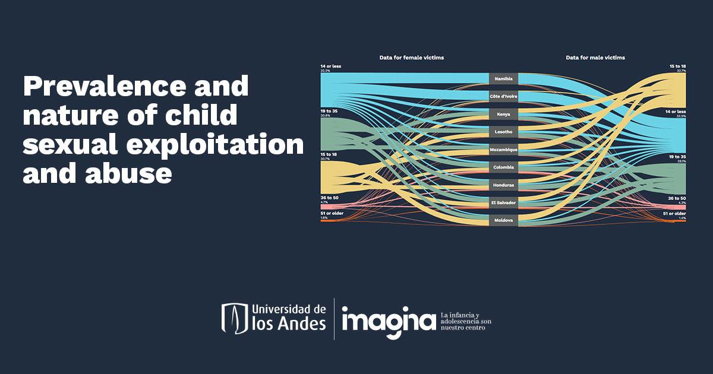

# Naturaleza y Prevalencia del abuso y explotación sexual a menores

Este sitio ofrece información sobre la prevalencia y naturaleza de la explotación y abuso sexual infantil (CSEA) utilizando datos de las Encuestas de Violencia contra Niños y Jóvenes (VACS) realizadas en 17 países. Destaca hallazgos clave, incluyendo variaciones en la prevalencia de CSEA, edad del primer abuso, polivictimización, nivel educativo y relaciones entre víctimas y perpetradores.
